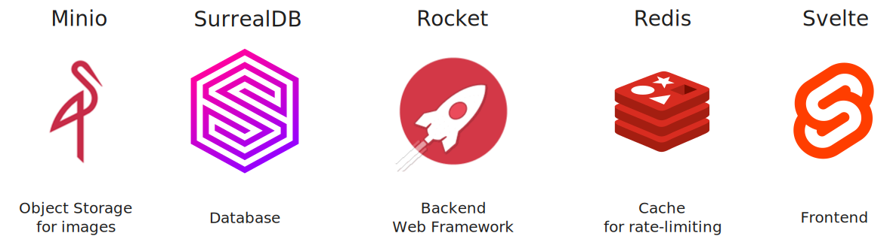
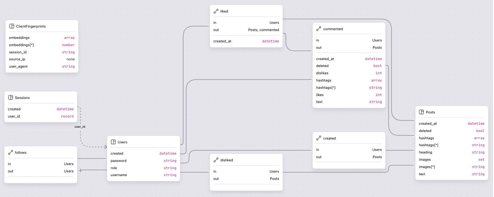

# Rocket Forum

## Tech Stack


## API Testing
The Webeng.json file can be imported into hoppscotch (and Postman?)
and contains the API endpoints with examples for the project.

## Running
To run the app
### Set up the environment
Fill out the env values. See .env.example for the required values (you can make
up a `SURREALDB_USER` and `SURREALDB_PASS`).
```sh
cp .env.example .env
```
If you intend to run the app in release mode, `ROCKET_SECRET_KEY` must be set.
This file does not need to be sourced, it's presence suffices.

### Start the database and object storage
```sh
docker compose up
```
### Start the server:
```sh
cargo run # for debug builds
cargo run --release # for optimized builds
```
## Docs
The documentation can be automatically generated:
```sh
cargo doc --no-deps
```

### State

The webserver is completely stateless as it saves all persistent database state
in a SurrealDB instance (local or cloud, depends on .env).
Similarly, all uploaded images are saved to a minio instance.
This means that the server can easily be scaled using a load balancer.

> [!warning] DDoS Protection
> We want to have rate-limiting while the server can remain stateless.
> It is not yet implemented but being worked on. We aim to use redis as a
> ephemeral storage.

## Database

We use SurrealDB with the following schema:


The database automatically initialised (if not already) once when the server
starts.
